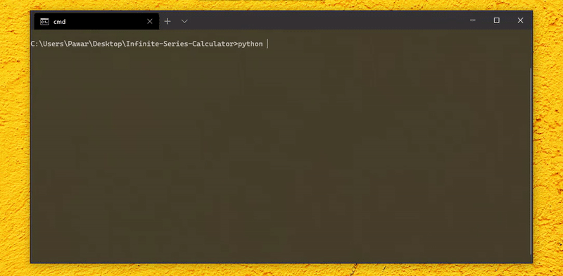
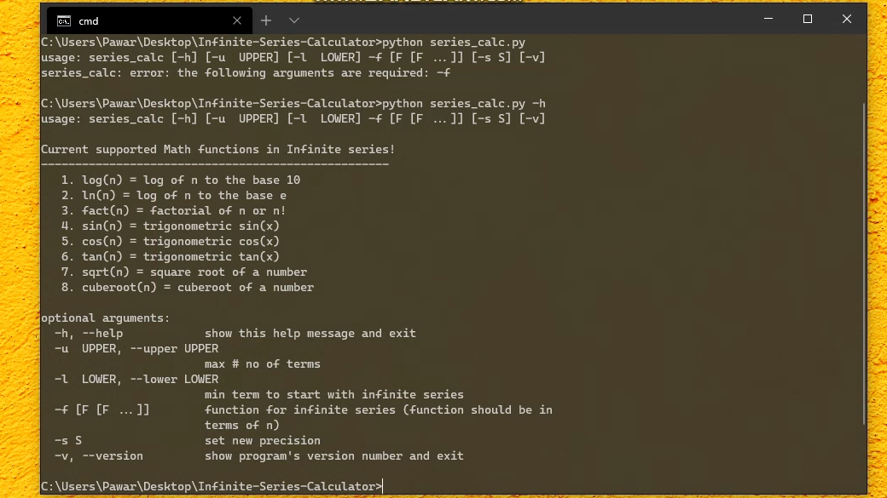

<div align="center">
	<h1>Infinite Series Calculator </h1>
    <br>

[](https://www.codacy.com/manual/pawarashish564/Infinite-Series-Calculator?utm_source=github.com&amp;utm_medium=referral&amp;utm_content=pawarashish564/Infinite-Series-Calculator&amp;utm_campaign=Badge_Grade)
[](https://marketplace.visualstudio.com/items?itemName=Aashish.emoji-in-git-commit)

<br>

[](https://forthebadge.com)
[](https://forthebadge.com)
[](https://forthebadge.com) 
[](https://forthebadge.com)

<!-- $\sum_{i=1}^{10} t_i$ -->
<!-- for equations https://latex.codecogs.com/ -->
<table width='100%' align="center">
    <tr align='center'>
        <td align='center' width='100%' colspan='2'>
           <strong>
           <code>Simple Infinite Series Calculator</code></strong><br />
            👉 Just Put a Series function,upper and lower limits and specifiy precision.
            <br>
            
        </td>
    </tr>
    <tr align='center' >
        <td align='center'>
            A FOSS (Free & Open Source Software) project. Maintained by <a href='https://github.com/pawarashish564'>@Aashish Pawar ⚡</a>.
        </td>
    </tr>
<tr align='center'  width='100%'><td align='center'><sup> Follow Aashish's #FOSS work on GitHub <a href='https://github.com/Pawarashish564'>@Aashish Pawar⚡</a> 
</a></sup>🙌</td></tr>
</table>

</div>

<br>

# 👉 Test a Infinite Series Function

> just use -f command line option with a function like ``` 1/n , 1/n**2, 1/fact(n),1/n*2,1/n**3 ``` etc and provide upper and lower limit (starting and ending points of a series).

Supported Mathematical functions are:

- 🥞fact(n) ✓ (calculation many n! type of series)
- 🤠 trigonometric functions sin(n), cos(n), tan(n) ✓
- 🐎 sqrt(n), cuberoot(n) ✓
- 🗃 More Functions coming soon ✓

<!-- - 💯 other series functions ✓ -->
<br>

## GETTING STARTED

Let's check simple infinite series convergence.

#### ⚡️ Quick Overview
Consider this series. 
<br>
<p align="center">

</p>
we know that this series converge to <a href="https://en.wikipedia.org/wiki/E_(mathematical_constant)">Eular constant (e)</a>. let check that using the tool.
<br>

💯 Run the following. 

```sh
python series_calc.py -f 1/fact(n) -l 0
```


> 🎛   _you'll get 2.718281828459045223732791526816949842789 which exacly equal to constant e_.

<br>

## Workflow 

There are just one option i.e -f which is important for your series_calc workflow. Specify the lower limit using -l or upper limit using -u and precision using -s (scale) option. 
<div align="center">

</div>
<br>
<!--  -->

## Help & Other

Use -h option to get information about all the options supported.



## Todo

- Arithmetic and mathematical functions
- Multiple Transforms 
- Mathematical Constants support
